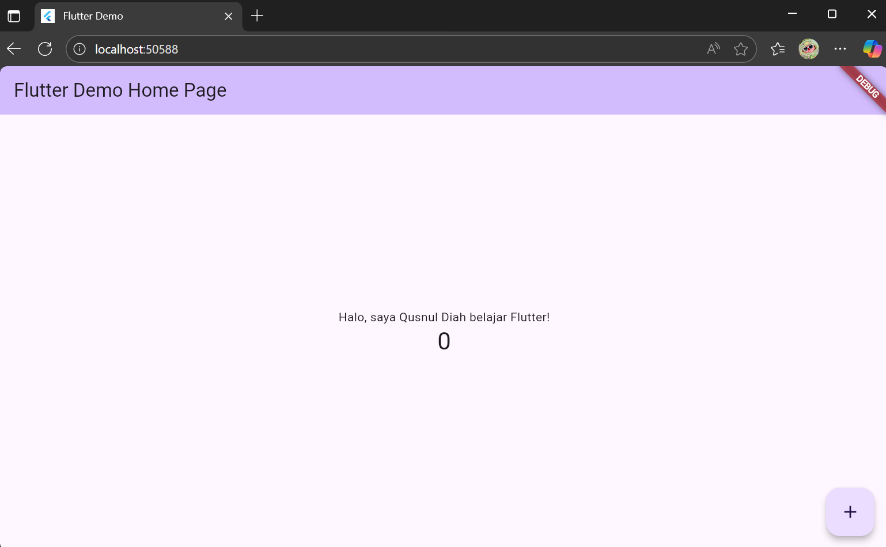

# hello_world

A new Flutter project.

# Laporan Praktikum Flutter 1
## Jobsheet 4 – Pemrograman Mobile

## disusun_oleh:
  - nama: Qusnul Diah Mawanti
  - nim: 2341760035
  - kela: 3D
  - program_studi: D-IV Sistem Informasi Bisnis
  - jurusan: Teknologi Informasi
  - institusi: Politeknik Negeri Malang
  - tahun: 2025

---

# Praktikum_1: Membuat Project Flutter Baru
  langkah_langkah:
  - Buka VS Code, tekan Ctrl + Shift + P, lalu ketik "Flutter: New Application Project".
    
  - Pilih folder penyimpanan project (disarankan di dokumen atau desktop).
  - Buat project dengan nama hello_world (huruf kecil semua, tanpa spasi).
    
  - Tunggu hingga muncul pesan "Your Flutter Project is ready!".
    hasil_screenshot:
    

---

# Praktikum_2: Menghubungkan Perangkat Android atau Emulator
  langkah_langkah:Hubungkan perangkat Android/iOS atau buka emulator.
  - Jalankan project hello_world dengan menekan F5 atau pilih Run → Start Debugging.
  - Tunggu hingga aplikasi tampil di layar perangkat atau emulator.
    hasil_screenshot: 

---

# Praktikum_3: Membuat Repository GitHub dan Laporan Praktikum
  langkah_langkah:
  - Login ke akun GitHub, lalu buat repository baru dengan nama flutter-fundamental-part1.
    
  - Kembali ke VS Code dan lakukan inisialisasi git:
  - perintah: git init
  - Tambahkan file .gitignore lalu commit:
    perintah:
    - git add .gitignore
    - git commit -m "tambah gitignore"
    - Hubungkan repository ke GitHub:
      perintah:
      - git remote add origin
        
      - git push -u origin main
      - Tambahkan file README.md,
        

---

# Praktikum_4: Menerapkan Widget Dasar
  ## langkah_1: Text Widget
  - Buat folder lib/basic_widgets.
  - Tambahkan file text_widget.dart berisi kode Text Widget.
  - Ganti teks dengan nama lengkap Anda.
    
  - Import ke main.dart dan tampilkan di aplikasi.
    
  - hasil_screenshot:
    

  ## langkah_2: Image Widget
  - Buat file image_widget.dart di folder basic_widgets.
    
  - Tambahkan aset gambar ke folder assets.
  - Sesuaikan file pubspec.yaml untuk menambahkan aset gambar.
    
  - Import ke main.dart dan jalankan project.
  - hasil_screenshot:
    

---

# praktikum_5: Menerapkan Widget Material Design dan iOS Cupertino
  ## langkah_1: Cupertino Button dan Loading Bar
  - Buat file loading_cupertino.dart di folder basic_widgets.
  - Gunakan kombinasi widget dari Material dan Cupertino.
    
    

  ## langkah_2: Floating Action Button (FAB)
  - Buat file fab_widget.dart.
    
  - Tampilkan teks "FAB ditekan" saat tombol ditekan.
    
    

  ## langkah_3: Scaffold Widget
  - Gunakan Scaffold untuk mengatur tata letak berbasis Material Design.
    
    
    

   ## langkah_4: Dialog Widget
   - Gunakan dua jenis dialog: AlertDialog dan SimpleDialog.
     
     

   ## langkah_5: Input dan Selection Widget
   - Implementasikan widget seperti Checkbox, Radio Button, Slider, Switch, dan TextField.
     
     

   ## langkah_6: Date and Time Pickers
   - Tambahkan widget pemilih tanggal dan waktu (DatePicker dan TimePicker).
     
     
   - hasil_screenshot:
     

---

# tugas_praktikum:
  - Selesaikan Praktikum 1–5 dan dokumentasikan setiap langkah dengan screenshot di file README.md.
  - Jalankan aplikasi di perangkat fisik dan sertakan hasilnya.
  - Untuk Praktikum 5 (Langkah 3–6), buat file widget terpisah di folder basic_widgets.
  - Selesaikan Codelabs: Your First Flutter App dan buat laporan di repository.
  - Sertakan hasil akhir tiap praktikum dengan menampilkan NIM dan Nama Anda.
  - Kumpulkan link repository GitHub kepada dosen pengampu.

---

# struktur_project:
  - hello_world/
    - assets/
      - images/
        - 01.png
    - lib/
      - main.dart
      - basic_widgets/
        - text_widget.dart
        - image_widget.dart
        - fab_widget.dart
        - loading_cupertino.dart
        - dialog_widget.dart
        - scaffold_widget.dart
        - input_widget.dart
        - date_time_picker.dart
    - pubspec.yaml
    - README.md
    - .gitignore

---

# referensi:
  - https://jti-polinema.github.io/flutter-codelab/01-pengenalan/
  - https://developer.android.com/codelabs/basic-android-kotlin-compose-connect-device?hl=id
  - https://codelabs.developers.google.com/codelabs/flutter-codelab-first#0
  - https://github.com/settings/tokens/new

---

copyright: "© 2025 Jurusan Teknologi Informasi – Politeknik Negeri Malang"

